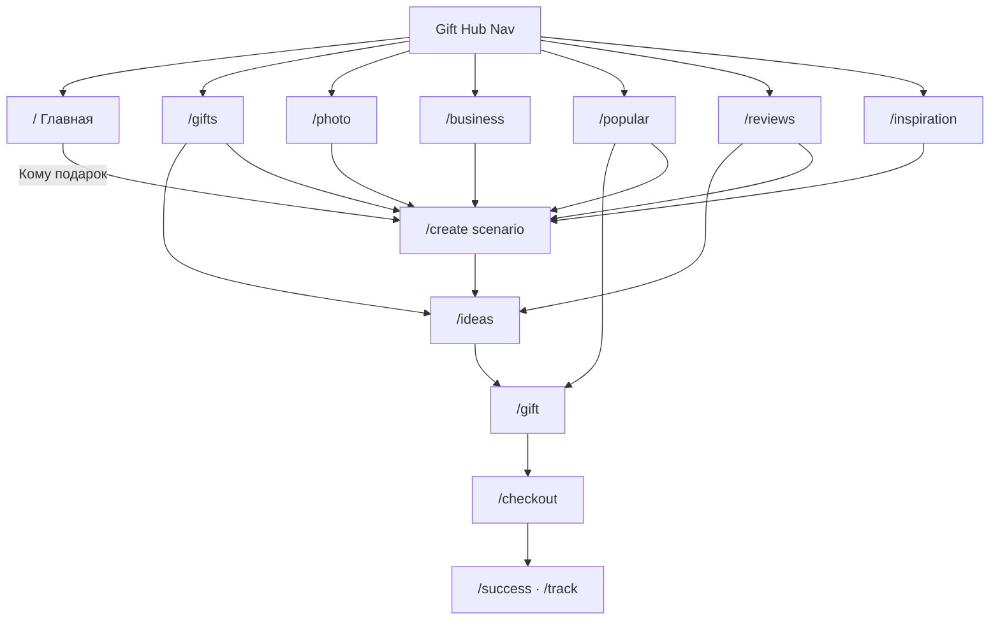

# Gift Hub — карта навигации (TASK-071 / TASK-072)

Бренд в UI: **Gift** (без «AI»).

Правило: **любой раздел Hub — максимум 1 клик** из шапки. Между любыми двумя страницами клиента — **≤ 2 клика**.

Источник пунктов шапки: `frontend/lib/gift-hub/nav.ts` → `GIFT_HUB_NAV`.

Живая главная (TASK-072): последние заказы · популярные подарки · получатели · отзывы → `/gift`.

---

## 1. Gift Hub (шапка)

| Раздел | URL | Что открывает | Дальше (1 клик) |
|--------|-----|---------------|-----------------|
| Главная | `/` | Hero, «Кому подарок», сценарии, популярное, отзывы | create / gifts / gift / ideas |
| Подарки | `/gifts` | Направление «подарок» | ideas, create, categories |
| Фотопечать | `/photo` | Каталог фотопечати | `/photo/[slug]`, create?scenario=photo |
| Для бизнеса | `/business` | Корпоративный лендинг | create?scenario=corporate |
| Популярное | `/popular` | Хиты + топ Gift Score | `/gift`, `/ratings`, create |
| Отзывы | `/reviews` | Истории клиентов | ideas / create (похожий) |
| Вдохновение | `/inspiration` | Идеи Inspiration Engine | create / design / ideas |

Дополнительно в подвале: Связаться `/contact`, Кабинет `/account`.

Служебные зоны **без** Gift Hub: `/admin`, `/owner`, `/partner*`, `/warehouse`, `/delivery`.

---

## 2. «Кому подарок» (главная)

Каждая карточка → сценарий `gift` с предзаполненным получателем:

`/create?scenario=gift&recipient=<дат.>&q=Подарок%20…`

| Карточка | recipient | |
|----------|-----------|--|
| Мама … Ребёнок | см. `HUB_RECIPIENTS` | |
| Смотреть все | `/create?scenario=gift` | полный wizard |

После wizard (gift/unsure/photo) → `/ideas` → Gift Page `/gift` → Checkout → Success / Track.

---

## 3. Карта основных потоков

---

## 4. Вторичные маршруты (≤ 2 клика из Hub)

| URL | Как дойти |
|-----|-----------|
| `/create` | Hub → Подарки/Главная CTA / карточка «Кому» |
| `/ideas` | create complete · поиск · популярное |
| `/gift?id=` | ideas · popular · ratings |
| `/checkout` | gift page «Заказать» |
| `/ratings` | popular «Все рейтинги» · кабинет |
| `/account` · `/login` | auth bar в Hub |
| `/express` | deep-link / legacy express «Кому?» |
| `/recipients` | кабинет |
| `/design` · `/configure` | inspiration / demo |
| `/inspiration/create` | кабинет после заказа |
| `/contact` | подвал |

---

## 5. Правило «без тупиков»

- Hub-страницы всегда содержат CTA в create / ideas / gift.
- Отзывы и вдохновение кликабельны → создание похожего.
- Inspiration на Gift Page остаётся контекстным (TASK-069); `/inspiration` — входной хаб, не галерея ради галереи.
